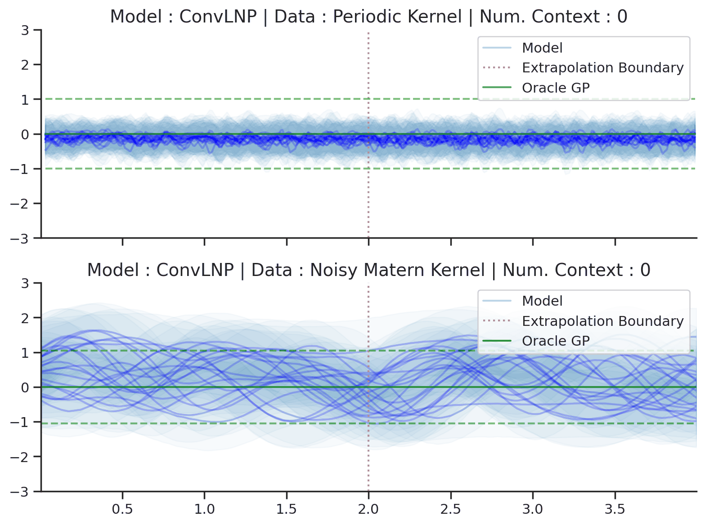
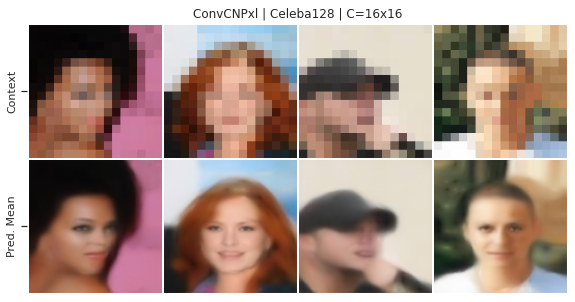

# Neural Process Family [](https://github.com/YannDubs/Neural-Process-Family/blob/master/LICENSE) [](https://www.python.org/downloads/release/python-360/)

Main entry point: [**Neural Process Family** website](https://yanndubs.github.io/Neural-Process-Family/text/Intro.html).

## What ?

This repository contains:
- the text of the [Neural Process Family webiste](https://yanndubs.github.io/Neural-Process-Family/text/Intro.html)
- the Pytorch code (training / plotting) as well as pretrained model to investigate the following models on image and synthetic 1D datasets:
    - CNP from [Conditional Neural Processes](https://arxiv.org/abs/1807.01613)
    - LNP from [Neural Processes](https://arxiv.org/abs/1807.01622)
    - AttnCNP and AttnLNP from [Attentive Neural Processes](https://arxiv.org/abs/1901.05761)
    - ConvCNP from [Convolutional Conditional Neural Processes](https://arxiv.org/abs/1910.13556) 
    - ConvLNP from [Meta-Learning Stationary Stochastic Process Prediction with Convolutional Neural Processes](https://arxiv.org/abs/2007.01332) 
- the ("official") code to replicate all the image experiments from [Convolutional Conditional Neural Processes](https://arxiv.org/abs/1910.13556) and [Meta-Learning Stationary Stochastic Process Prediction with Convolutional Neural Processes](https://arxiv.org/abs/2007.01332). For 1D experiments see [ConvNP](https://github.com/wesselb/NeuralProcesses.jl) and [ConvCNP](https://github.com/cambridge-mlg/convcnp).

For tutorials on how to use the npf library refer to the [reproducability section](https://yanndubs.github.io/Neural-Process-Family/reproducibility/CNP.html) of the [NPF website](https://yanndubs.github.io/Neural-Process-Family/text/Intro.html).

## Install

### Pip

```
# clone repo
pip install -r requirements.txt
```

Note that the version of skorch must be 0.8 to ensure that the pretrained models can be correctly uploaded.

### Docker

1. Install [nvidia-docker](https://github.com/NVIDIA/nvidia-docker)

2. Build your image using `Dockerfile` or pull `docker pull yanndubs/npf:gpu`

3. Create and run a container, e.g.:
`docker run --gpus all --init -d --ipc=host --name npf -v $PWD:/Neural-Process-Family -p 8888:8888 -p 6006:6006 yanndubs/npf:gpu jupyter lab --ip=0.0.0.0 --port=8888 --no-browser --allow-root`

## Examples

Check the [website](https://yanndubs.github.io/Neural-Process-Family/text/Intro.html) for many plots and the code to produce them.
Here is a teaser:

Sample functions from the predictive distribution of ConvLNPs (blue) and the oracle GP (green) with periodic and noisy Matern kernels:



Increasing the resolution of 16x16 CelebA to 128x128 with a ConvCNP.:



## Cite

When using one of the models implemented in this repo in academic work please cite the corresponding paper (linked at the top of the README).

In case you want to cite the NPF website or this specific implementation of the NPs then you can use:

```
@misc{dubois2020npf,
  title        = {Neural Process Family},
  author       = {Dubois, Yann and Gordon, Jonathan and Foong, Andrew YK},
  month        = {September},
  year         = {2020},
  howpublished = {\url{http://yanndubs.github.io/Neural-Process-Family/}}
}
```


